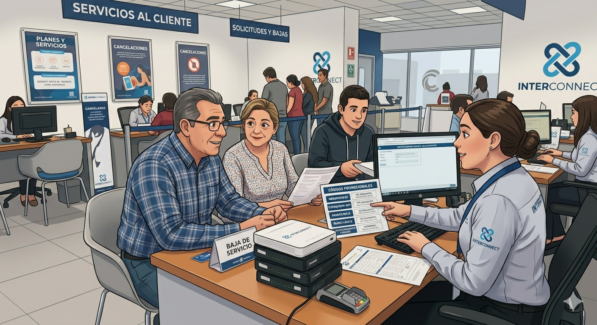
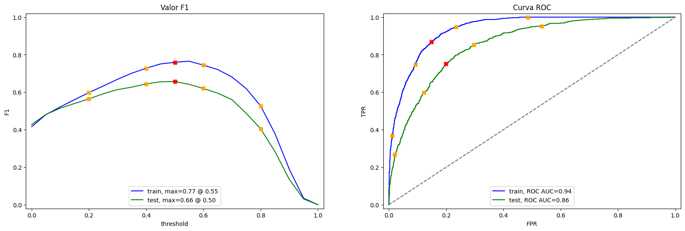
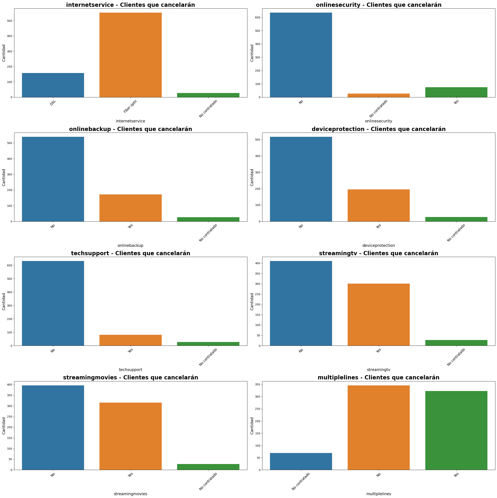

# Predicción de clientes a darse de baja

 
 
 

## **Descripción del proyecto** 
El operador de telecomunicaciones Interconnect requiere pronosticar su tasa de cancelación de clientes. Si se descubre que un usuario o usuaria planea irse, se le ofrecerán códigos promocionales y opciones de planes especiales. El equipo de marketing de Interconnect ha recopilado algunos de los datos personales de sus clientes, incluyendo información sobre sus planes y contratos.

**Servicios de Interconnect**

Interconnect proporciona principalmente dos tipos de servicios:

1. Comunicación por teléfono fijo. El teléfono se puede conectar a varias líneas de manera simultánea.
2. Internet. La red se puede configurar a través de una línea telefónica (DSL, *línea de abonado digital*) o a través de un cable de fibra óptica.

Algunos otros servicios que ofrece la empresa incluyen:

* Seguridad en Internet: software antivirus (*ProtecciónDeDispositivo*) y un bloqueador de sitios web maliciosos (*SeguridadEnLínea*).
* Una línea de soporte técnico (*SoporteTécnico*).
* Almacenamiento de archivos en la nube y backup de datos (*BackupOnline*).
* Streaming de TV (*StreamingTV*) y directorio de películas (*StreamingPelículas*)

La clientela puede elegir entre un pago mensual o firmar un contrato de 1 o 2 años. Puede utilizar varios métodos de pago y recibir una factura electrónica después de una transacción.
 
 
 

## **Objetivos del proyecto**
Los pasos realizados en este proyecto son los siguientes:

* Análisis exploratorio de los 4 diferentes conjunto de datos, se realizó limpieza de datos nulos o bien sustitución de valores incorrecto, así como verificación de los valores dentro del conjunto de datos y estandarización de títulos.
  
* Unión de conjuntos de datos y graficado para entender relaciones de variables y tendencias, así como balanceo de clases.

* Se hizo la división en conjunto de entrenamiento y prueba y se escalaron o estandarizaron variables numéricas y se codificaron las variables de clasificación.

* Se entrenaron múltiples modelos (ajustando varios hiperparámetros) empezando desde los mas básicos hasta llegar al modelo que cumplía con la metrica buscada de AUC-ROC mayor a 0.88, de igual manera se estuvo monitoreando la métrica de F1, recall y precisión.  
 
 
 

## **Lenguajes y herramientas usadas**

**Plataforma:** Jupyter Notebook

**Análisis exploratorio de datos:** Python, Pandas, Seaborn, Matplotlib, Scikit-learn, . 

**Modelos de predicción:** Dummy Classifier, Logistic Regression, Random Forest Classifier, Decision Tree Classifier. 

**Métricas utilizadas:** F1, Área bajo la curva (AUC-ROC), recall, precisión, accuracy. 
 
 
 

## **Conclusiones**

 Los resultados obtenidos fueron los siguientes:

*Dummy Classifier:*

La estrategia que mejor se comporto fue la constante con valor de 1 y esto debido a que mantuvo un ROC de 0.50 en ambos datasets, F1 fue de 0.43 practicamente, accuracy fue 0.26 para entrenamiento y 0.27 para prueba. Esto se uso de referencia para entrenar los siguientes modelos.
 
*Logistic Regression:*

Los hiperparametros que mejor funcionaron fueron el solver lbfgs, C de 1, obviamente la clase balanceada y maximo de iteracion de 200 y esto debido a que mantuvo un ROC de 0.84 para entrenamiento y 0.85 para prueba, F1 fue de 0.61 para entrenamiento y 0.64 para prueba, accuracy fue 0.74 para entrenamiento y 0.75 para prueba. Se observo una mejora significativa con respecto al modelo dummy pero aun fuera de que se busca para este negocio o proyecto. Se observo que el modelo puede detectar mas facilmente los clientes que se mantienen con servicio en la empresa a los que se van.

*Decision Tree Classifier:*

Los hiperparametros que mejor funcionaron fueron splitter: best, el minimo de muestras para dividir un nodo de 10, el minimo de muestras en una hoja de 40, numero de caracteristicas consideradas para cada division: Ninguna, profundidad maxima del arbol de 20, la funcion para media la calidad de la division fue gini y obviamente la clase balanceada. Esto mantuvo un ROC de 0.87 para entrenamiento y 0.84 para prueba, F1 fue de 0.65 para entrenamiento y 0.63 para prueba, accuracy fue 0.77 para entrenamiento y 0.74 para prueba. Se observo una mejora significativa en las metricas pero aun el modelo batalla para poder identificar los clientes que se van de la empresa, los que se mantienen mejora mucho la identificacion.

*Random Forest Classifier:*

Los hiperparametros que mejor funcionaron fueron splitter: numero de arboles en el bosque de 100, minimo de muestras para dividir un nodo de 10, minimo de muestras en la hoja de 5, numero de caracteristicas consideradas en cada division es sqrt, profundidad maxima de cada arbol de 15, la funcion para media la calidad de la division fue gini y obviamente la clase balanceada. Esto mantuvo un ROC de 0.94 para entrenamiento y 0.86 para prueba, F1 fue de 0.76 para entrenamiento y 0.66 para prueba, accuracy fue 0.86 para entrenamiento y 0.79 para prueba. Se observo una mejora en la identificacion de clientes que van de la empresa en el entrenamiento pero en la de prueba bajo ese porcentaje.

Dado el analisis anterior el modelo que mejor se comporto en terminos generales fue el Random Forest Classifier, es por eso que esa es la eleccion para la prediccion de los clientes de este proyecto, esta empresa y con estos datasets.

 

De igual manera se utilizaron los resultados del modelo para poder obtener la tasa de cancelacion real vs la del modelo, obtenido lo siguiente:

El modelo Random Forest Classifier obtuvo una tasa de prediccion aproximada de 35% vs la real de 27%, lo que hace que el modelo este por arriba del real en un 8% aproximadamente. Posteriormente se verificaron los servicios que se dejaran de tener por esos clientes que cancelan, quedando de la siguiente manera:

1. El servicio de internet de fibra optica
2. El servicio de lineas telefonicas(multiples o simples)
3. El servicio de streaming tv y de peliculas
 

